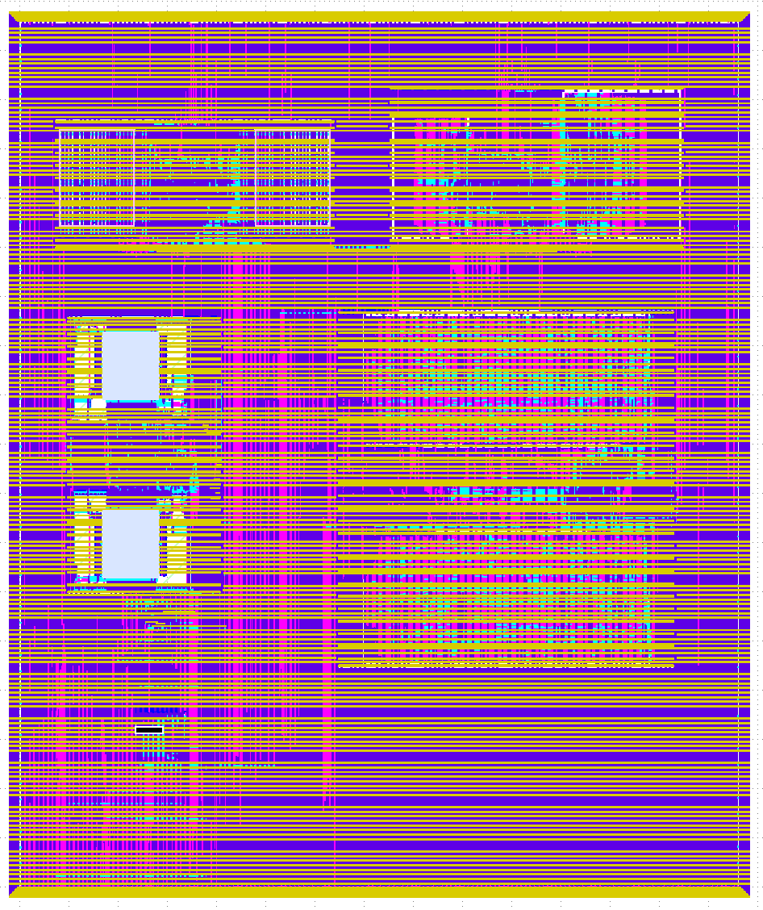

# Caravel Leros Project

 

This is a user project for the Caravel harness, integrating the open-source Leros CPU core.
This repository contains the DTU subsystem from the [Edu4Chip](https://edu4chip.github.io/) tapeout project.

Checkout with submodules:

    git clone --recurse-submodules git@github.com:os-chip-design/caravel_leros_2025.git

Or later:

    git submodule update --init --recursive

Then start Docker and follow [the Docs](docs/source/index.md), or as follows:

    make setup

Install the CF RAM and the DFF RAM (it should be included in the Makefile on Linux, below is for Mac):

    pip3 install --break-system-packages cf-ipm
    ipm install CF_SRAM_1024x32
    ipm install DFFRAM256x32
    gunzip ip/DFFRAM256x32/layout/gds/DFFRAM256x32.gds.gz

Unzip the GDS of the registerfile test:

    gunzip macro/rf_top.gds.gz

Generate the Leros Verilog files (not needed as the SV files are included):

    make generate-verilog

then harden the wrapper for the memory

    make CF_SRAM_1024x32_wrapper LIBRELANE_USE_NIX=1

and the register file

    make reg-file LIBRELANE_USE_NIX=1

and the register based memories

    make regmem_128 LIBRELANE_USE_NIX=1
    make regmem_256 LIBRELANE_USE_NIX=1

then build and harden different Leros versions:

    make leros-cfram LIBRELANE_USE_NIX=1
    make leros-openram LIBRELANE_USE_NIX=1
    make leros-dffram LIBRELANE_USE_NIX=1
    make leros-regmem LIBRELANE_USE_NIX=1

and then include all in the wrapper for Caravel:

    make user_project_wrapper LIBRELANE_USE_NIX=1

Note that the `LIBRELANE_USE_NIX=1` can speedup the builds with Nix is installed.
**However, it does not produce correct results on Mac currently.***
The issue is in the KLayout DRC checks. The produced GDS are fine.

Then install the CF tools and the design should be ready for **tapeout** (submit to CF) ;-)

    cf init
    cf push

Or do a precheck first:

    make precheck
    DISABLE_LVS=1 make run-precheck

The Leros test case can be run with cocotb:

    make cocotb-verify-leros_adder_test-rtl

## TODO

* [x] Setup Caravel on Mac (MS, TP)
* [x] Setup Caravel on chipdesign1
* [x] Harden the example project
* [x] Run the provided tests
* [x] MPW check
* [x] Test upload to ChipFoundry (user is martin-schoeberl)
* [ ] Change example to Chisel top level (with a simple design) and harden it
* [x] Have some basic tests
* [x] Add DTU subsystem (inclusive memories)
* [x] Make sure to use 10 MHz for the serial port
* [ ] Set pin defines in defines.v
* [x] TODO: there is a mismatch between io_out vs io_gpio_out
* [x] Explore three different memories
  - [x] OpenRAM
  - [x] CF RAM
  - [x] DFF RAM
* [x] Have a RV Wishbone test to boot Leros
* [x] Maybe have three versions on the same chip
* [x] Add some more simple example on the top level (WB IO, Sylvan's RF, ttsky25-tapeout/SKY130_register_file_testing)
* [ ] Add a block diagram of the project architecture.
* [ ] Include instructions on how to build and simulate the project.

Refer to [README](docs/source/index.md) for basic Caravel documentation.

## Address Map

Wishbone User space is mapped as follows: 0x3000_0000 - 0x300F_FFFF

| Address Range                 | Description                    |
|-------------------------------|--------------------------------|
| 0x3000_0000 - 0x3000_FFFF     | Leros with CF SRAM             |
| 0x3001_0000 - 0x3001_FFFF     | Leros with OpenRAM SRAM        |
| 0x3002_0000 - 0x3002_FFFF     | Leros with DFF RAM             |
| 0x3003_0000 - 0x3003_FFFF     | Leros with RTL Register File   |
| 0x3004_0000 - 0x3004_FFFF     | Sylvan's Register File         |
| 0x3005_0000 - 0x3005_FFFF     | Wishbone 6-bit GPIO            |

## GPIO Mapping

| Range         | Description                  |
|---------------|------------------------------|
| 37:32         | Wishbone 6-bit GPIO          |
| 31            | HelloMorse                   |
| 30:25         | Leros with OpenRAM SRAM      |
| 24:19         | Leros with CF SRAM           |
| 18:13         | Leros with RTL Register File |
| 12:7          | Leros with DFF RAM           |
| 6:0           | Blocked by caravel           |

## The Chip GDS:

